# Microblog — Product & Architecture Deck

> A slide-style walkthrough of the Microblog platform: what it is, why it exists, how
> it's built, the trade-offs behind each choice, how to deploy it, and the metrics that
> tell us whether it's healthy. Each `---` is a "slide". All diagrams are Mermaid and
> render natively on GitHub / VS Code.

---

## Slide 1 — What is this product?

**Microblog** is a Twitter/X-style microblogging platform: users register, post short
content, follow each other, like posts, comment, and get embedding-based "more like this"
recommendations.

But the *product* is not the feature list — the feature list is deliberately small. The
real product is a **reference implementation of a read-heavy, write-amplified social
backend** that shows how to keep a feed fast and cheap under load without lying to users
about durability.

| | |
|---|---|
| **Domain** | Social microblogging (posts, follows, likes, comments) |
| **Shape of load** | Read-heavy, spiky writes (likes/follows come in bursts) |
| **Core thesis** | Serve hot paths from Redis, persist truth in SQL Server, reconcile asynchronously |
| **Audience** | Backend engineers studying caching / eventual-consistency / scale trade-offs |
| **Stack** | ASP.NET Core (.NET 10) · SQL Server · Redis · optional Kafka / Azure Service Bus · OpenAI embeddings |

---

## Slide 2 — Why does it exist? (Dev scope & intent)

Most CRUD tutorials write straight to a database and call it done. That falls over the
moment a single post gets liked 50,000 times in a minute — every like becomes a row
insert and a `COUNT(*)`.

This project exists to explore the **opposite discipline**: treat the database as the
*source of truth* but never let it sit on the critical path of a high-frequency action.

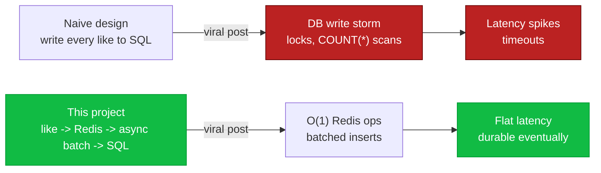

**In scope:** caching strategy, background sync, rate limiting, observability, pluggable
messaging/storage, AI recommendations.
**Deliberately thin:** the home feed endpoint is a stub, the UI is minimal — because the
point is the *backend mechanics*, not pixels.

---

## Slide 3 — The 10,000-ft system map

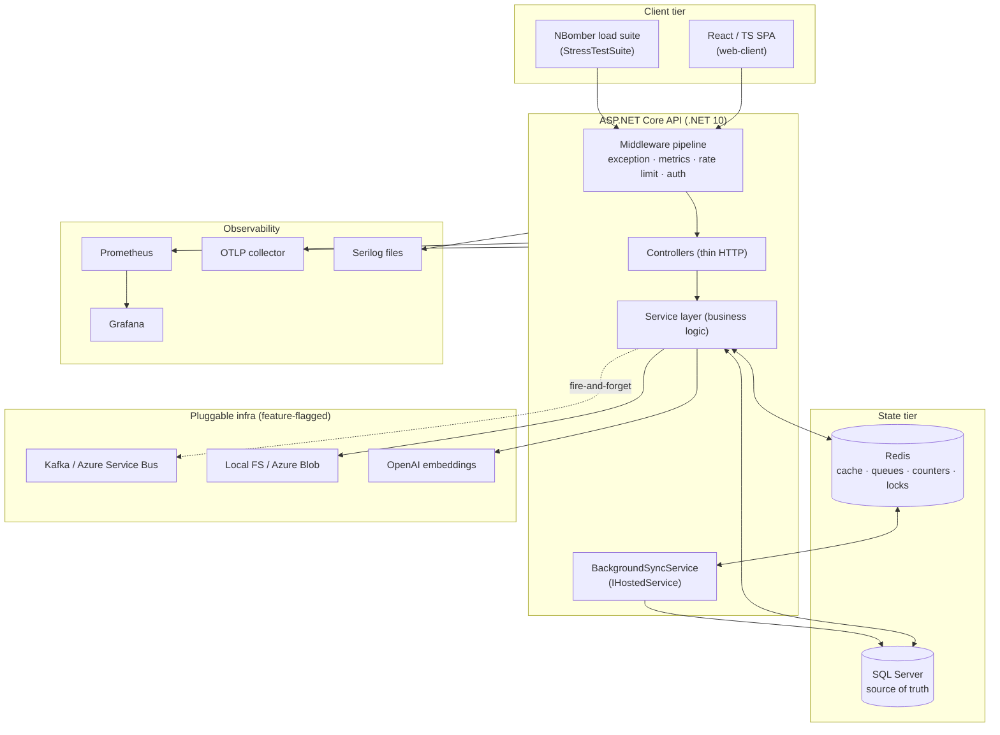

**One rule to read the whole system by:** *fast-path writes touch Redis; the
`BackgroundSyncService` drains Redis into SQL Server on a timer.*

---

## Slide 4 — Layered architecture & why it's shaped this way

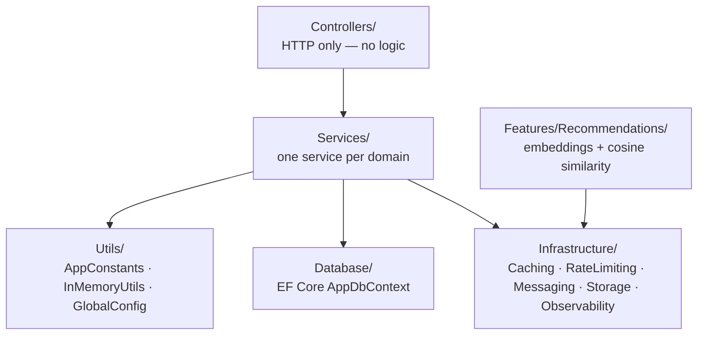

| Layer | Responsibility | Why this boundary |
|---|---|---|
| **Controllers** | Parse request, call one service, wrap response | Keeps HTTP concerns out of logic; trivial to test/load-test |
| **Services** | All business rules, cache vs DB decisions | One service per domain (Post, Comment, Auth, UserFollow, UserLike, Media, UserProfile) = clear ownership |
| **Infrastructure** | Cross-cutting tech behind interfaces | Lets messaging/storage be swapped via config, not code |
| **Utils/AppConstants** | Redis key shapes + operation enums | Single place to audit cache keys — **check here before adding new ones** |

> Convention worth knowing: every controller returns `CommonUtils.ControllerResponseParams`
> (`Success` / `Message` / `Data`) so the frontend and load tests parse one shape everywhere.

---

## Slide 5 — The signature pattern: eventual consistency via Redis queues

This is the heart of the project. Walk a **like** through the system:

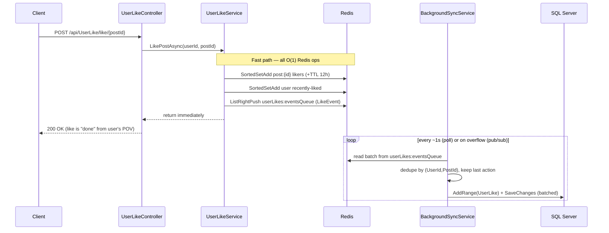

**Why:** a like must feel instant and survive virality. Redis absorbs the burst at O(1);
SQL gets **batched, de-duplicated** inserts instead of one row per click.

**Safety nets in the code:**
- If Redis throws, `LikePostAsync` falls back to a **direct DB write** (`LikePostDbFallbackAsync`) — correctness over speed.
- A **queue-overflow guard** (`ClearQueueOverflow`) trims the event list when it nears `CacheMemoryLimit`, and a Redis **pub/sub channel** (`FlushAndClearQueueOverflow`) can trigger an out-of-band flush instead of waiting for the next poll.
- The background drain holds a per-operation `SemaphoreSlim(1,1)` so two polls never process the same queue concurrently.

---

## Slide 6 — Reads, counts, and the consistency contract

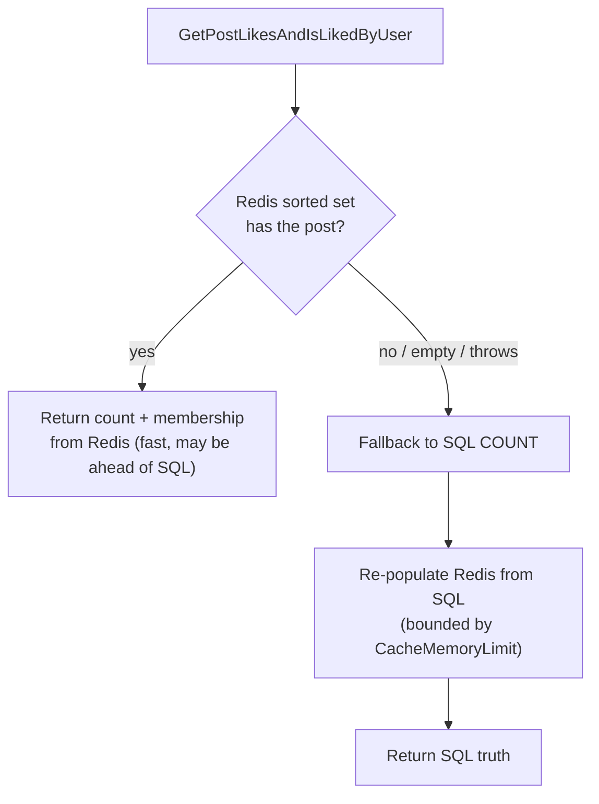

**The contract to keep straight when reading this code:**

| Action | Write path | Durability at return | Read source |
|---|---|---|---|
| **Like / Unlike** | Redis first, async → SQL | Eventually consistent (seconds) | Redis, SQL on miss |
| **Follow / Unfollow** | **SQL first** (synchronous `SaveChanges`), then Redis sets updated | Strongly consistent | Redis sets, SQL on miss |
| **Post create/update** | SQL synchronous; event + embedding fire-and-forget | Strong for the post; async for side-effects | SQL |
| **Auth tokens** | SQL for refresh tokens; Redis for blacklist | Strong | both |

> ⚠️ Note for the team: the README describes the queue pattern for *both* likes and
> follows, but in the current code **only likes go through the background queue**.
> Follows are dual-written (SQL then cache). Worth deciding whether that's intended
> before load-testing follow-heavy scenarios.

---

## Slide 7 — Authentication flow

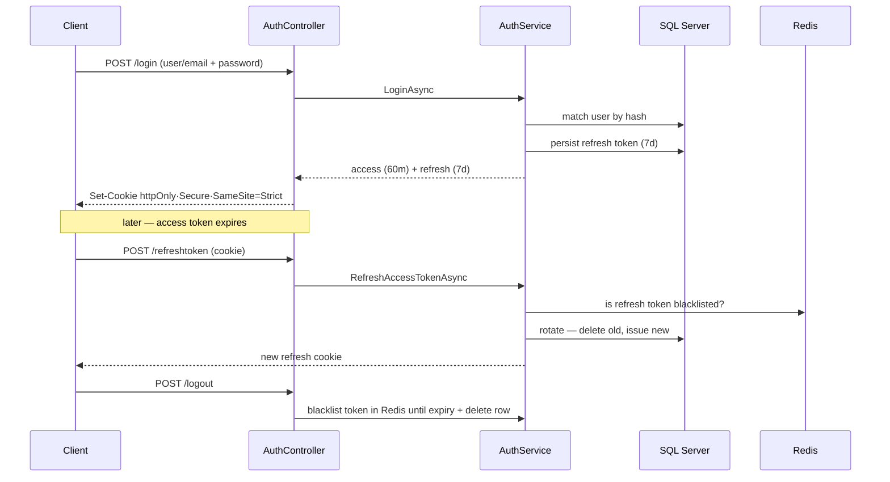

**Choices & why:**
- **JWT in HTTP-only / Secure / SameSite=Strict cookies** — defends against XSS token theft and CSRF, and the SPA never has to handle raw tokens (the Axios wrapper just retries on 401).
- **Refresh-token rotation + Redis blacklist** — a stolen refresh token has a short, revocable life; blacklist TTL is bounded by the token's own expiry so Redis self-cleans.
- **Symmetric HMAC-SHA256 signing key** — simple for a single-service deployment; would move to asymmetric keys / Key Vault for multi-service.

---

## Slide 8 — Rate limiting (distributed, per-endpoint)

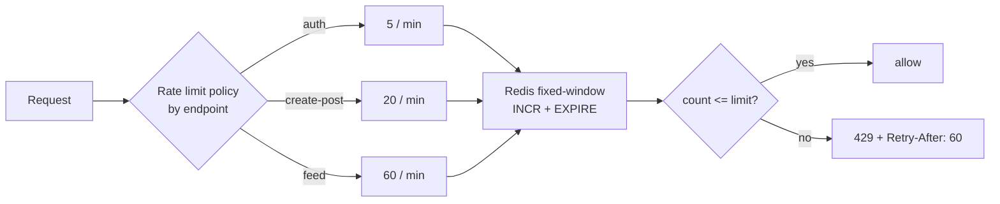

- **Redis-backed fixed window** (`RedisFixedWindowRateLimiter`) so the limit is **shared across all API instances**, not per-process. The counter is a single `INCR`; the first hit sets `EXPIRE` = window.
- **Partition key = userId when authenticated, else client IP** — authenticated users get their own bucket; anonymous traffic is throttled per IP.
- **Disabled entirely in Development** (`GlobalLimiter = NoLimiter`) so local dev and load tests aren't throttled by accident — *important for the NBomber work: run the API in Production mode to exercise limits, Development mode to find raw ceilings.*

---

## Slide 9 — Background processing engine

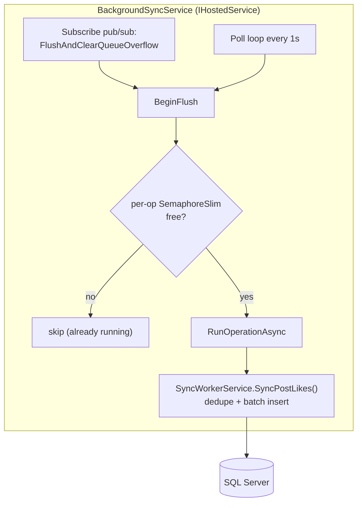

**Design decisions to highlight:**
- **One hosted service, switch on operation type.** Today only `LIKE_EVENT_*` is wired to real work; the other enum branches are intentional placeholders for follows/media/etc. — the scaffolding is there to extend.
- **Token-secret guard:** `SyncWorkerService` refuses to run unless handed a secret `Guid` that only `BackgroundSyncService` holds. This stops other code from accidentally triggering raw DB drains (which, unguarded, could crash the app).
- **Two triggers, one drain:** the timer handles steady state; the pub/sub channel handles *overflow* bursts so the queue can't grow unbounded between ticks.
- **Batch + dedupe before insert:** rapid like→unlike→like collapses to the last action per `(user, post)` — fewer rows, no thrash.

---

## Slide 10 — Pluggable infrastructure (config over code)

Three subsystems are swapped by `appsettings.json` feature flags, resolved once at startup
in `Program.cs`:

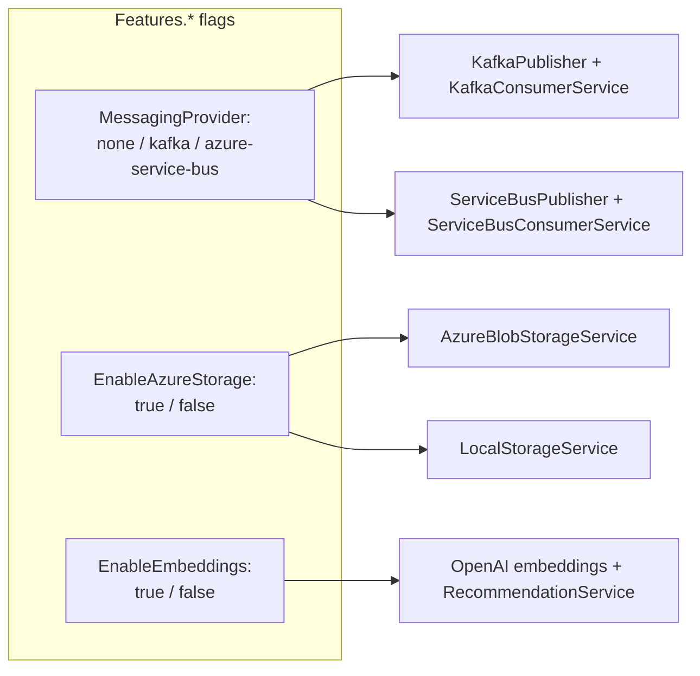

| Subsystem | Abstraction | Implementations | Why pluggable |
|---|---|---|---|
| Messaging | `IMessagePublisher` + consumer hosted service | Kafka, Azure Service Bus | Durable event delivery with DLQ + retry; pick infra per environment |
| Storage | `IStorageService` | Local FS, Azure Blob | Dev runs local; prod runs blob — same code |
| Recommendations | `IEmbeddingProvider` | OpenAI (HuggingFace stub) | Off by default (needs API key + cost) |

**Messaging is best-effort & fire-and-forget** from the request path (`_ = Task.Run(...)`),
so the API never blocks on a broker. The consumer side adds **retry with backoff → DLQ**
for durability.

---

## Slide 11 — AI recommendations (optional)

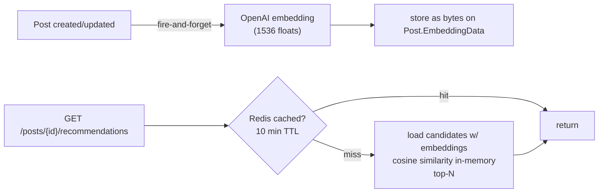

- Embeddings are stored as **raw float bytes on the `Post` row** (compact, no extra table).
- Similarity is an **in-memory cosine scan** — fine for a demo, explicitly flagged in code
  to be replaced by **pgvector / Azure AI Search** at real scale.
- Results cached via the generic **cache-aside `ICacheService` with RedLock** stampede
  protection (one computer recomputes; others wait or read-through).

---

## Slide 12 — Observability (how we know it's alive)

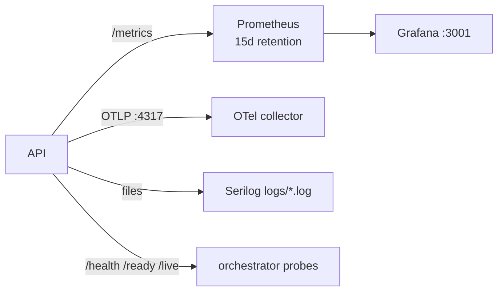

**Instrumented out of the box:**
- **Prometheus metrics** at `/metrics` (HTTP server metrics + custom `microblog_*` counters/gauges).
- **OpenTelemetry traces + metrics** (ASP.NET Core + HttpClient instrumentation) exported via OTLP.
- **Serilog** to console + daily rolling files, enriched with machine name & thread id.
- **Health checks**: `/health` (all), `/health/ready` (SQL + Redis tagged `ready`), `/health/live`.

---

## Slide 13 — Custom product metrics & what they tell you

These are the `microblog_*` series defined in `AppMetrics` — the dashboard you'd watch
during a load test:

| Metric | Type | What it answers |
|---|---|---|
| `microblog_cache_hits_total` / `_misses_total` | counter (by op) | Is the cache actually absorbing reads? |
| `microblog_background_sync_queue_depth` | gauge | Is the drain keeping up, or is the like queue growing? |
| `microblog_background_sync_processed_total` / `_errors_total` | counter | Throughput & failure rate of the SQL drain |
| `microblog_posts_created_total`, `microblog_post_likes_total` | counter | Business throughput |
| `microblog_embeddings_generated_total` / `_errors_total` | counter | AI subsystem health |
| `microblog_messages_published_total` / `_errors_total` | counter (by topic) | Broker health + DLQ pressure |
| `microblog_active_sessions` | gauge | Approx concurrent authenticated users |

> The single most important one for this architecture is **`background_sync_queue_depth`**:
> if it climbs without bound under load, Redis is outrunning the SQL drain and you've found
> a real scaling limit.

---

## Slide 14 — How to deploy

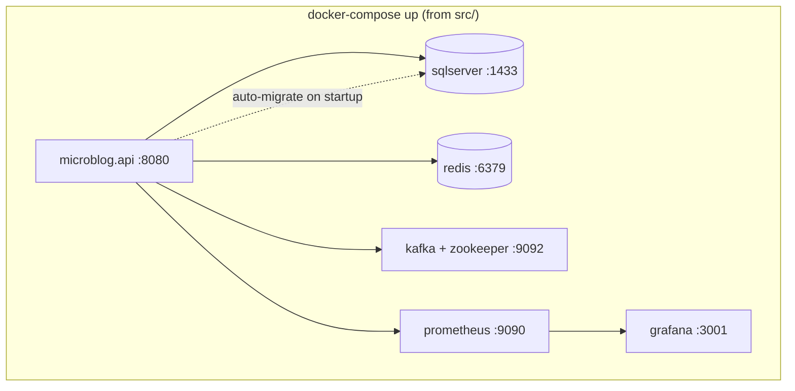

**Local (no Docker):** run SQL Server + Redis, set connection strings in
`appsettings.Development.json`, then `dotnet run --launch-profile https` from
`src/Microblog.Api` (https://localhost:7282).

**Full stack:** `docker-compose up` from `src/` brings up API + SQL + Redis + Kafka +
Prometheus + Grafana. The API **auto-applies EF migrations on startup**
(`db.Database.MigrateAsync()`), so a fresh database is provisioned automatically.

**Production hardening already wired:**
- `ASPNETCORE_ENVIRONMENT=Production` → rate limiting **on**, CORS locked to `localhost:3000` (change to your domain).
- **Azure Key Vault** loads first and overrides `appsettings` when `Azure:KeyVaultUri` is set — *no secrets in config files.*
- **Polly** standard resilience (retry + circuit breaker + timeout) on outbound OpenAI calls.
- HTTPS redirection, health probes for `ready`/`live` orchestration.

**Config that must change before real prod:** the JWT signing key, SQL `sa` password, and
CORS origin are demo values in `appsettings.json` — move them to Key Vault / env vars.

---

## Slide 15 — Expected metrics & SLO targets (the load-test scoreboard)

> These are **target hypotheses** to validate with the NBomber suite — not measured
> results. They define "the limit" we're about to go find.

| Dimension | Healthy target | Warning | Hard limit signal |
|---|---|---|---|
| Like p95 latency (Redis fast path) | < 25 ms | 25–100 ms | > 100 ms → Redis saturated |
| Read p95 (post/feed, cache hit) | < 50 ms | 50–200 ms | > 200 ms |
| Post-create p95 (SQL synchronous) | < 150 ms | 150–500 ms | > 500 ms → SQL write pressure |
| Error rate | < 0.1% | 0.1–1% | > 1% |
| `background_sync_queue_depth` | stable / drains each tick | slowly rising | unbounded growth → drain can't keep up |
| Cache hit ratio (likes/reads) | > 90% | 70–90% | < 70% → keys expiring too fast |
| Rate-limit 429s (prod mode) | only above policy limits | — | 429s below limit → misconfig |

**Throughput intuition for the architecture:**
- Likes should scale far higher than posts — they're O(1) Redis ops vs synchronous SQL inserts.
- The bottleneck is expected to migrate from the API → SQL drain (`SyncWorkerService`) as like volume rises; watch queue depth and batch insert latency together.

---

## Slide 16 — Known sharp edges (be honest before stress-testing)

A load test is most useful when you already suspect where it'll break:

1. **Follows aren't queued** — they do a synchronous `SaveChanges` per call, so follow
   storms hit SQL directly (unlike likes). Expect follows to cap lower than likes.
2. **`GetFollowerIdList` queries `FollowerId`** to build the *followers* set — looks like
   a copy/paste of the following query. Verify before trusting follower counts under load.
3. **Password hashing is deterministic** (same input → same hash, used for both store and
   compare). Cheap under load, but **not** a salted/slow KDF — a security note, not a perf one.
4. **`GetStatistics()` / `AttemptAcquire` on the Redis limiter return stubs** — only the
   async acquire path is real; don't rely on limiter statistics in dashboards.
5. **Home feed is a stub** (returns empty) — there's no real fan-out/read-feed to test yet.
6. **Embedding similarity is an in-memory full scan** — fine cold, will not scale; keep
   `EnableEmbeddings=false` for raw throughput runs.

---

## Slide 17 — Next step: the NBomber stress suite (preview)

The existing `StressTestSuite/Microblog.LoadTests` is a stub (one register scenario). The
plan is to grow it into a suite that pushes each subsystem to its limit:

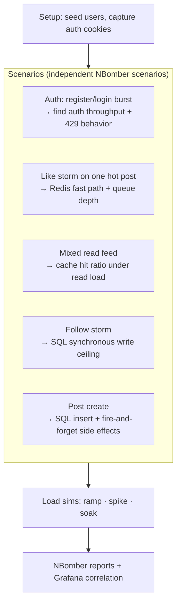

We'll wire each scenario to the corresponding endpoint, run against **Production mode** (to
exercise rate limits) and **Development mode** (to find raw ceilings), and correlate
NBomber's client-side latency with the server-side `microblog_*` metrics from Slide 13.

> **This deck is the map. The NBomber suite is the expedition — that's what we build next.**
