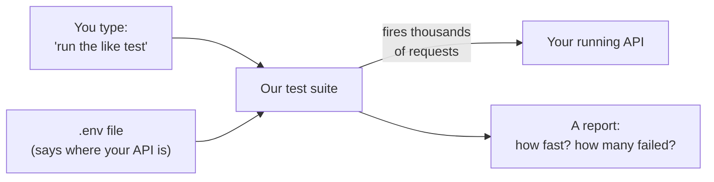
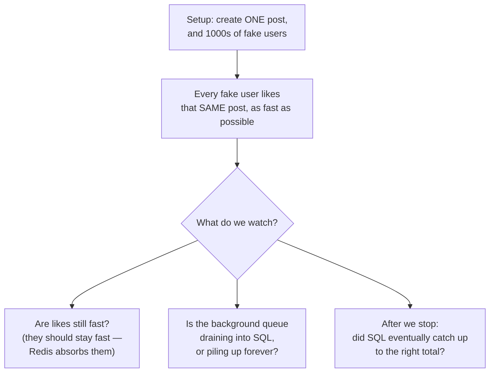

# Microblog Load-Test Suite — The Plan (in plain English)

This document explains, simply, what we're going to build to "stress test" your API.
No jargon without explanation. Read it top to bottom — each part builds on the last.

---

## Part 1 — What is a load test, really?

A **load test** is a program that pretends to be thousands of users hitting your API at
the same time, so you can answer one question:

> **"How much traffic can my app handle before it slows down or breaks?"**

You run it on your laptop. It fires real HTTP requests at your running API (login, create
post, like post, etc.) over and over, as fast as we tell it to, and then it gives you a
report: how fast each request was, how many succeeded, and when things started failing.

We use a tool called **NBomber** for this (it's already in your project). Think of NBomber
as the engine that fires the requests and writes the report. We just tell it *what* to fire
and *how hard*.

---

## Part 2 — What we're building, in one picture



The whole thing is a small program. You tell it which test to run, it reads your API's
address from a settings file, it hammers that API, and it hands you a report.

---

## Part 3 — Your four rules, explained simply

You gave four requirements. Here's what each one means and how we'll meet it.

**Rule 1: "One file = one test."**
Every test lives in its own file. If you want to understand the "like" test, you open
`LikeStormHotPost.cs` and everything is right there. No jumping between files.

**Rule 2: "Each test runs on its own."**
You can run just the "like" test without first running anything else. The test sets up
*everything it needs by itself* — it registers its own fake users, creates its own posts,
then starts hammering. Nothing depends on another test having run first.

**Rule 3: "I can move the folder anywhere and point it at any API."**
The test folder won't be glued to your project. You could copy it to a USB stick, give it
to a friend with a different microblog API, and it would still work. To make this true, the
tests don't borrow any code from your `Microblog.Api` project — they carry their own small
copies of what they need.

**Rule 4: "The API address comes from an env file."**
There's a plain text file called `.env`. It has one important line:

```ini
BASE_URL=http://localhost:5182
```

That line is the only thing you change to point the tests at a different API. The address
is never written inside the test code.

---

## Part 4 — How you'll actually run it

From inside the test folder, you type commands like these:

```powershell
# Run just the "like storm" test
dotnet run -- --scenario like-storm

# Run just the login test
dotnet run -- --scenario auth-login

# Run every test, one after another
dotnet run -- --scenario all

# See the list of available tests
dotnet run -- --list
```

> Small technical note: a C# program can only have one "start" point, so we use a tiny
> menu (we call it the *dispatcher*) that reads the name you typed and starts that one test.
> You still get the feeling of "running one test" — the menu just routes you to it.

---

## Part 5 — The folder layout

```
Microblog.LoadTests/          <-- this whole folder is portable; copy it anywhere
│
├─ .env                       <-- your API address lives here
├─ Program.cs                 <-- the menu that picks which test to run
│
├─ Shared/                    <-- small helpers every test reuses
│   ├─ Config.cs              <-- reads the .env file
│   ├─ ApiClient.cs           <-- the thing that sends HTTP requests
│   ├─ AuthHelper.cs          <-- registers + logs in a fake user
│   ├─ UserPool.cs            <-- makes a batch of logged-in fake users
│   ├─ LoadProfiles.cs        <-- "how hard to push" settings
│   └─ Dtos.cs                <-- copies of your request shapes (for portability)
│
└─ Scenarios/                 <-- the actual tests, ONE FILE EACH
    ├─ Auth/      (register, login, token refresh)
    ├─ Posts/     (create, read, update, delete, recommendations)
    ├─ Comments/  (add, edit, read)
    ├─ Follows/   (follow, unfollow, read followers/following)
    ├─ Likes/     (like storm, like/unlike churn, read counts)
    └─ Mixed/     (realistic mix of everything, rate-limit check)
```

**Why is there a `Shared/` folder if every test is supposed to be self-contained?**
Because some boring jobs are the same in every test — like "send an HTTP request" or
"log in a fake user". Instead of copy-pasting that into 21 files, we write it once in
`Shared/` and each test *uses* it. These helpers don't run on their own and don't remember
anything between tests, so they don't break Rule 2.

---

## Part 6 — A few words that will keep coming up

Before the test list, here are the only terms you need. Plain definitions:

- **Request** — one call to your API, e.g. "POST /api/UserLike/like/5".
- **Fake user** — the test registers and logs in a throwaway account so it can call
  endpoints that require login. We make a bunch of these up front so the test behaves like
  many different people, not one person spamming.
- **Cookie / token** — when a fake user logs in, your API hands back a login cookie. The
  test holds onto it and attaches it to every request, exactly like a browser would.
- **Latency** — how long one request took, in milliseconds. Lower is better.
- **p95 latency** — "95% of requests were at least this fast." It's a fairer measure than
  an average, because it shows the experience of your slower requests too. Example: "p95 =
  40ms" means 95 out of 100 requests finished within 40ms.
- **Throughput** — how many requests per second your API handled. Higher is better.
- **Setup step** — the part at the start of a test where it creates the fake users and data
  it needs before the hammering begins.

---

## Part 7 — How hard do we push? (load profiles)

Every test can push at different intensities. We'll have a few preset intensities you pick
in the `.env` file. Same test, different amount of pressure:

| Name | What it does | Why you'd use it |
|---|---|---|
| **smoke** | Very gentle, ~10 seconds | Quick check: "does this even work?" Always run first. |
| **ramp** | Slowly turn up the pressure | See *when* things start slowing down. |
| **spike** | Calm, then a sudden flood, then calm | See if a sudden rush breaks it. |
| **soak** | Steady pressure for a long time (10–30 min) | Catch slow problems like memory leaks. |
| **stress** | Keep pushing harder until it breaks | Find the absolute breaking point. |

---

## Part 8 — The list of tests (this is the important part)

Below is every test we'll write, grouped by feature. For each one:
- **What it hits** — the endpoint(s).
- **What it's checking** — in plain words.
- **Priority** — ⭐ = build first (these prove the most important things about your app),
  then 🔹 important, then ▫️ nice-to-have.

### Auth (login & accounts)

| Priority | Test file | What it hits | What it's checking |
|---|---|---|---|
| 🔹 | `AuthRegister.cs` | `POST /Auth/register` | How many new sign-ups per second before it slows. Each sign-up writes a row to SQL and checks for duplicates. |
| ⭐ | `AuthLogin.cs` | `POST /Auth/login` | How fast logins are. Important because **every login also writes a new token row to the database** — that's hidden extra work we want to measure. |
| 🔹 | `AuthTokenLifecycle.cs` | `POST /Auth/refreshtoken`, `/logout` | Tests the "stay logged in" and "log out" flow, which touches both SQL and Redis. |

### Posts

| Priority | Test file | What it hits | What it's checking |
|---|---|---|---|
| ⭐ | `PostCreate.cs` | `POST /Post` | How many posts per second. Creating a post writes **straight to SQL right away** (no shortcut), so this finds your database write ceiling. |
| ⭐ | `PostReadById.cs` | `GET /Post/{id}` | How fast reading one post is. Right now this reads straight from the database with no cache — good baseline. |
| ▫️ | `PostHomeFeed.cs` | `GET /Post/homefeed` | This endpoint is currently empty (returns nothing). We test it just to measure the "cost of doing nothing" — the overhead of login + checks + plumbing. |
| 🔹 | `PostUpdate.cs` | `PATCH /Post/{id}` | Editing a post. |
| 🔹 | `PostDelete.cs` | `DELETE /Post/{id}` | Deleting a post (each fake user deletes posts it made itself). |
| ▫️ | `PostRecommendations.cs` | `GET /Post/{id}/recommendations` | The "more like this" AI feature. Only meaningful if you turn embeddings on. |

### Comments

| Priority | Test file | What it hits | What it's checking |
|---|---|---|---|
| 🔹 | `CommentAdd.cs` | `POST /Comment` | Posting comments to SQL. |
| ▫️ | `CommentUpdate.cs` | `PUT /Comment` | Editing a comment. |
| 🔹 | `CommentReadByPost.cs` | `GET /Comment?postId=` | Reading all comments on a post — watch if it slows as a post gets lots of comments. |

### Follows

| Priority | Test file | What it hits | What it's checking |
|---|---|---|---|
| ⭐ | `FollowStorm.cs` | `POST /UserFollow/follow/{id}` | **The opposite of the like test.** A follow writes straight to SQL *and* does several extra lookups, so it should handle far less traffic than likes. This proves *why* likes use the fast path and follows don't. |
| 🔹 | `Unfollow.cs` | `POST /UserFollow/unfollow/{id}` | Unfollowing. |
| 🔹 | `FollowersRead.cs` | `GET /UserFollow/{id}` | Reading someone's followers (from Redis, falling back to SQL). |
| 🔹 | `FollowingRead.cs` | `GET /UserFollow/following/{id}` | Reading who someone follows. |

### Likes (the star of the show)

| Priority | Test file | What it hits | What it's checking |
|---|---|---|---|
| ⭐ | `LikeStormHotPost.cs` | `POST /UserLike/like/{id}` | **The most important test.** Thousands of fake users all like the *same one post* at once — like a tweet going viral. Your app is built to absorb this in Redis and write to SQL slowly in the background. This test checks whether that actually holds up. |
| ⭐ | `LikeUnlikeChurn.cs` | like then unlike, repeatedly | Tests the smart part of your background worker that collapses "liked then unliked then liked" into just the final action, instead of writing every flip-flop to SQL. |
| 🔹 | `LikeReadCounts.cs` | (reading like counts) | Checks how fast reading a post's like count is. ⚠️ See open question #2 — there may be no endpoint for this yet. |

### Mixed (realistic & safety checks)

| Priority | Test file | What it hits | What it's checking |
|---|---|---|---|
| ⭐ | `RealisticTraffic.cs` | a blend of everything | Real users mostly *read*, sometimes like, rarely post. This mixes all actions in lifelike proportions (~70% reading, ~20% liking, ~10% writing) to find your *real-world* capacity, not just one endpoint at a time. |
| 🔹 | `RateLimitBehavior.cs` | auth / post / feed | Your app limits how often someone can call certain endpoints (5, 20, 60 times per minute). This test confirms those limits actually kick in and return the right "slow down" response. |

That's **21 tests covering every endpoint your API has.**

---

## Part 9 — The one test to understand above all others

If you only get one concept from this whole document, get this one — it's the heart of your
project and the headline of the test suite.

**`LikeStormHotPost` — what it does and why it matters:**



Your app's whole design bet is: *"a like should feel instant even when a post goes viral,
because we save it to fast memory (Redis) first and copy it to the database (SQL) slowly in
the background."*

This test is how we find out if that bet pays off — and exactly how many likes per second
it takes before the background copying can't keep up. **That number is "the limit" you
asked us to find.**

---

## Part 10 — The order we'll build it

1. **First, the foundation** — the helpers in `Shared/` and the menu. We'll prove it works
   by pointing `.env` at your API and running a tiny "smoke" check.
2. **Then the ⭐ tests** — like storm, post create, follow storm, login, realistic mix.
   These prove the most important things about your app.
3. **Then the 🔹 tests** — fill in the rest of the endpoints.
4. **Finally the ▫️ tests + breaking-point runs** — push until things fail and write down
   the limits.

---

## Part 11 — Questions I need you to answer

These genuinely change what we build, so I need your call. (Answer in plain words — I'll
handle the technical side.)

1. **Should the tests run against your app with its speed limits ON or OFF?**
   - OFF (Development mode): we find the *true* maximum speed of your app.
   - ON (Production mode): more realistic, but most tests will quickly hit the "slow down,
     too many requests" wall and we won't learn the real ceiling.
   - *My suggestion:* mostly OFF to find limits, plus one test with it ON to confirm the
     limits work. **Which do you want as the default?**

2. **There's no way to read a post's like count from the outside.** Your code can count
   likes internally, but no endpoint exposes it. Do you want to:
   - (a) skip testing like-reads,
   - (b) add a small new endpoint to your API so we can test it, or
   - (c) check it indirectly?

3. **The tests create fake users and posts every time they run, so your database will fill
   up with junk.** Is that fine, or do you want the tests to clean up after themselves /
   use a separate throwaway database?

Once you answer these three, I'll start building the foundation (step 1 above).

---

*(If you want even more plain-English detail on any single test, just ask and I'll expand
that one.)*
